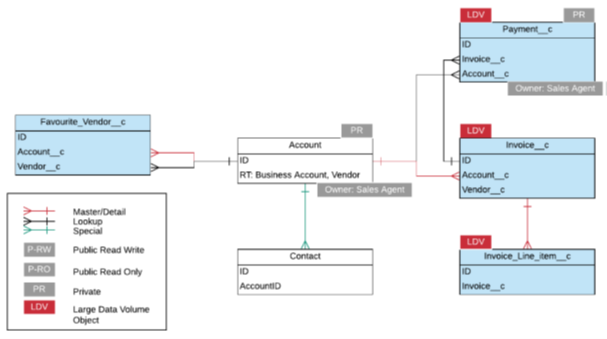

[Table of Contents](../Documentation.md)

# Data Model

## Description

The objective of this section is to describe the data model needed to answer the requirements defined in the scenario.

It requires to highlight the following informations:
* Distinguish standard and custom object (ex: add "__c" for custom)
* Highlight objects concerned by LDV
* Show the OWD configured for each object (private, public read only, public read/write)
* Highlight Master-detail and lookup relationships
* When private, show the owner of the record
* Show the record types when needed

## Example

