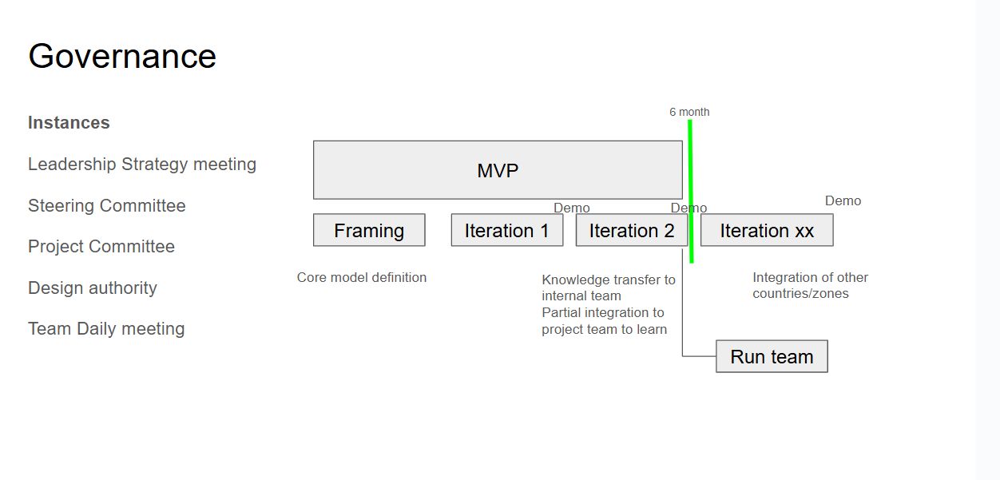

[Table of Contents](../Documentation.md)

# Governance

## Description

The objective of this section is to describe the project delivery strategy.

It should contain the following information:

* delivery methodology (hybride, SAFe, agile SCRUM, waterfall...)
* The different committees (steering committee, COE, design authority, daily...)
* Country roll-out if required
* Run & enhancements management

## Example

