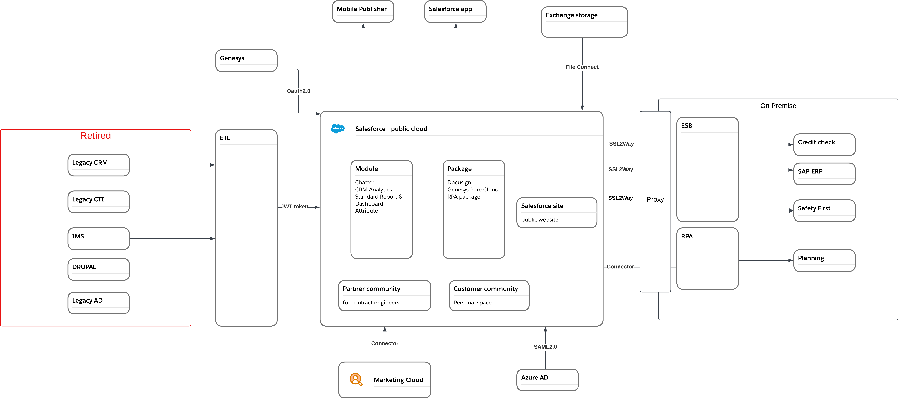
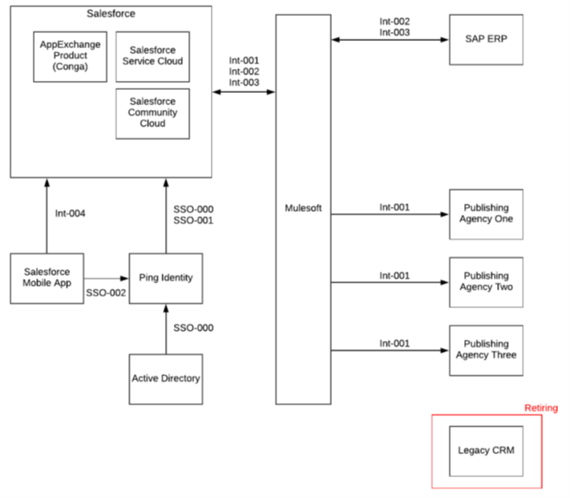

[Table of Contents](../Documentation.md)

# System Landscape

## Description

The objective of this section is to describe the technical architecture to answer the reqirements of the given scenario.

It should contain:
* the retired systems highlighted with the ETL for data migration used
* All the integrations with the authentication flow chosen
* In the salesforce landscape, highlight the main modules, managed packages and features enabled

# Example

