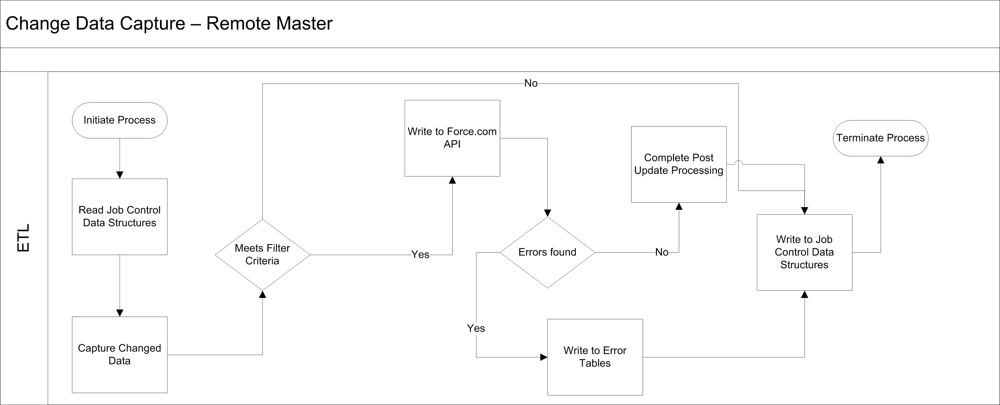

[Table of Contents](../Documentation.md)

# Batch Data Synchronization

## Description
Purpose of this pattern is to mass query or mass import data between Salesforce and external systems.

Generally, an ETL is used.

## Solutions

| Solution | Fit | Data Master | Comments                      |
|----------|-----|-------------|------------------------------|
| Salesforce Change Data Capture | Best | Salesforce | It publishes change events which represents changes to salesforce records. It includes create, update, delete and undelete operations. Near real time. It publishes the delta. |
| Replication via third-party ETL tool | Best | Remote System | Leverage a third-party ETL tool that allows you to run change data capture against source data. The tool reacts to changes in the source data set, transforms the data, and then calls Salesforce Bulk API to issue DML statements. |
| Replication via third-party ETL tool | Good | Salesforce | Leverage a third-party ETL tool that allows you to run change data capture against ERP and Salesforce data sets. In this solution, Salesforce is the data source, and you can use time/status information on individual rows to query the data and filter the target result set. This can be implemented by using SOQL together with SOAP API and the query() method, or by using SOAP API and the getUpdated() method. |
| Remote Call-In | Suboptimal | Remote System | It’s possible for a remote system to call into Salesforce by using one of the APIs and perform updates to data as they occur. However, this causes considerable on-going traffic between the two systems. Greater emphasis should be placed on error handling and locking. This pattern has the potential for causing continual updates, which has the potential to impact performance for end users. |
| Remote process invocation | Suboptimal | Salesforce | It’s possible for Salesforce to call into a remote system and perform updates to data as they occur. However, this causes considerable on-going traffic between the two systems. Greater emphasis should be placed on error handling and locking. This pattern has the potential for causing continual updates, which has the potential to impact performance for end users. |

## Sequence Diagram

## Middleware considerations

| Property            | Mandatory | Desirable | Not required |
|---------------------|-----------|-----------|---------|
| Event Handling | | ✅ | |
| Protocol conversion | ✅ | ✅ | |
| Translation and transformation | ✅ | | |
| Queuing and buffering | ✅ | | |
| Synchronous transport protocols | | | ✅ |
| Asynchronous transport protocols | ✅ | | |
| Mediation routing | | ✅ | |
| Process choreography and service orchestration | ✅ |  | |
| Transactionality (encryption, signing, reliable delivery, transaction management) | | ✅ | |
| Routing | | ✅ | |
| Extract, transform, and load | ✅ | | |
| Long Polling | ✅ (required for Salesforce Change Data Capture) | | |

