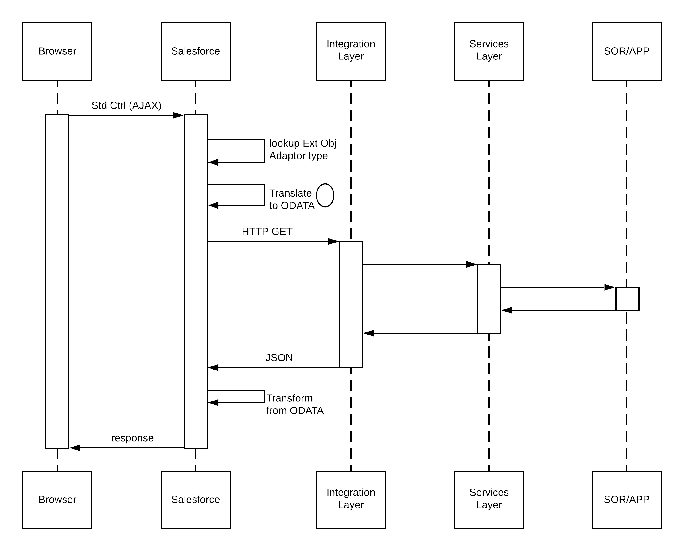

[Table of Contents](../Documentation.md)

# Data Virtualization

## Description

## Solutions

| Solution       | Fit     | Comments                         |
|----------------|---------|---------------------------------|
|Salesforce Connect|Best|Use Salesforce Connect to access data from external sources, along with your Salesforce data. Pull data from legacy systems such as SAP, Microsoft, and Oracle in real time without making a copy of the data in Salesforce.
Salesforce Connect maps data tables in external systems to external objects in your org. External objects are similar to custom objects, except that they map to data located outside your Salesforce org. Salesforce Connect uses a live connection to external data to always keep external objects up-to-date. Accessing an external object fetches the data from the external system in real time. Salesforce Connect lets you: Query data in an external system. Create, update, and delete data in an external system. Access external objects via list views, detail pages, record feeds, custom tabs, and page layouts. Define relationships between external objects and standard or custom objects to integrate data from different sources. Enable Chatter feeds on external object pages for collaboration. Run reports (limited) on external data. View the data on the Salesforce mobile app. To access data stored on an external system using Salesforce Connect, you can use one of the following adapters: OData 2.0 adapter or OData 4.0 adapter — connects to data exposed by any OData 2.0 or 4.0 producer. Cross-org adapter — connects to data that’s stored in another Salesforce org. The cross-org adapter uses the standard Lightning Platform REST API. Unlike OData, the cross-org adapter directly connects to another org without needing an intermediary web service. Custom adapter created via Apex — if the OData and cross-org adapters aren’t suitable for your needs, develop your own adapter with the Apex Connector Framework.|
|Request and Reply|Suboptimal|Use Salesforce web service APIs to make ad-hoc data requests to access and update external system data. This solution includes the following approaches: Use Salesforce SOAP API. A custom Visualforce page or button initiates an Apex SOAP callout in a synchronous manner. In Salesforce, you can consume a WSDL and generate a resulting proxy Apex class. This class provides the necessary logic to call the remote service. A user-initiated action on a Visualforce page then calls an Apex controller action that executes this proxy Apex class to perform the remote call. Visualforce pages require customization of the Salesforce app. Use Salesforce REST API. A custom Visualforce page or button initiates an Apex HTTP callout (REST service) in a synchronous manner. In Salesforce, you can invoke HTTP services using standard GET, POST, PUT, and DELETE methods. You can use several HTTP classes to integrate with RESTful services. A user-initiated action on a Visualforce page then calls an Apex controller action that executes these proxy Apex classes to perform the remote call. Visualforce pages require customization of the Salesforce app.|

## Sequence Diagram

## Middleware considerations

| Property            | Mandatory | Desirable | Not required |
|---------------------|-----------|-----------|---------|
| Event Handling | | ✅ | |
| Protocol conversion | ✅ | | |
| Translation and transformation | ✅ | | |
| Queuing and buffering | ✅ | | |
| Synchronous transport protocols | ✅ | | |
| Asynchronous transport protocols | | ✅ | |
| Mediation routing | | ✅ | |
| Process choreography and service orchestration | | ✅ | |
| Transactionality (encryption, signing, reliable delivery, transaction management) | ✅ | | |
| Routing | | | ✅ |
| Extract, transform, and load | | | ✅ |
| Long Polling | | | ✅ |

