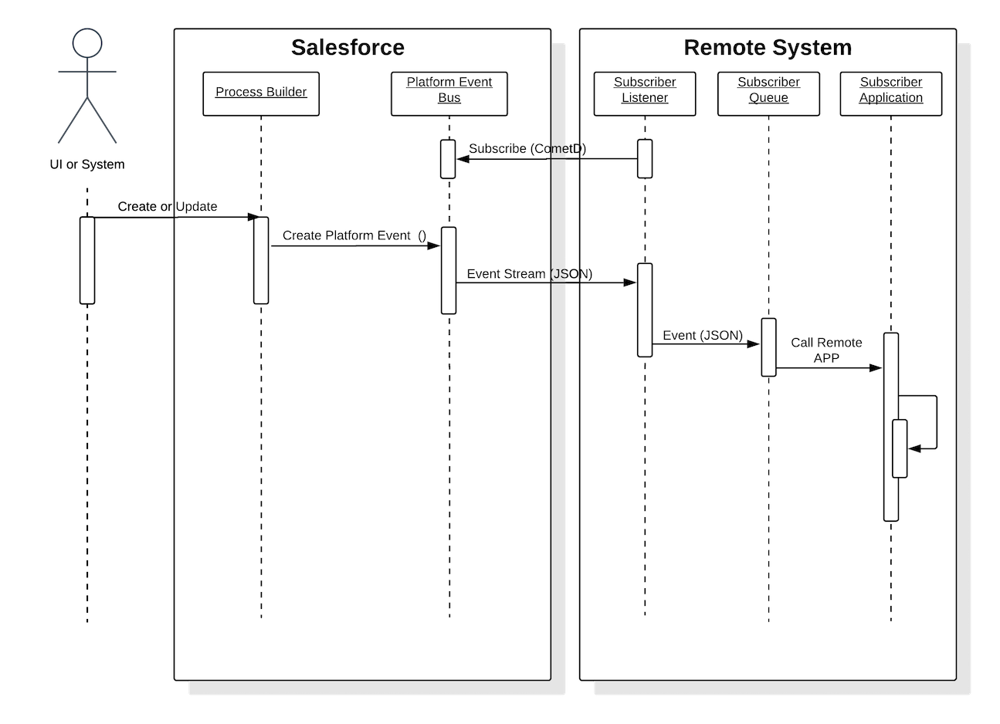

[Table of Contents](../Documentation.md)

# Fire & Forget

## Description
Purpose is to synchronize in near real time data between Salesforce and external systems with no need of synchronous acknoweldgement.

Common use case is synchronization with data referentials.

## Solutions

| Solution       | Fit     | Comments                         |
|----------------|---------|---------------------------------|
|Process-driven platform events|Best|No customization is required in Salesforce to implement platform events. The recommended solution is when the remote process is invoked from an insert or update event. Platform events are event messages (or notifications) that your apps send and receive to take further action. Platform events simplify the process of communicating changes and responding to them without writing complex logic. One or more subscribers can listen to the same event and carry out actions. For example, a software system can send events containing information about printer ink cartridges. Subscribers can subscribe to the events to monitor printer ink levels and place orders to replace cartridges with low ink levels. External apps can listen to event messages by subscribing to a channel through CometD. Platform apps, such as Visualforce pages and Lightning components, can subscribe to event messages with CometD as well.|
|Customization-driven platform events|Good|Similar to process-driven platform events, but the events are created by Apex triggers or classes. You can publish and consume platform events by using Apex or an API. Platform events integrate with the Salesforce platform through Apex triggers. Triggers are the event consumers on the Salesforce platform that listen to event messages. When an external app uses the API or a native Salesforce app uses Apex to publish the event message, a trigger on that event is fired. Triggers run the actions in response to the event notifications.|
|Workflow-driven outbound messaging|Good|No customization is required in Salesforce to implement outbound messaging. The recommended solution for this type of integration is when the remote process is invoked from an insert or update event. Salesforce provides a workflow-driven outbound messaging capability that allows sending SOAP messages to remote systems triggered by an insert or update operation in Salesforce. These messages are sent asynchronously and are independent of the Salesforce user interface. The outbound message is sent to a specific remote endpoint. The remote service must be able to participate in a contract-first integration where Salesforce provides the contract. On receipt of the message, if the remote service doesn’t respond with a positive acknowledgment, Salesforce retries sending the message, providing a form of guaranteed delivery. When using middleware, this solution becomes a “first-mile” guarantee of delivery.|
|Outbound messaging and callbacks|Good|Callbacks provide a way to mitigate the impacts of out-of-sequence messaging. In addition, they handle these scenarios. Idempotency— If an acknowledgment isn’t received in a timely fashion, outbound messaging performs retries. Multiple messages can be sent to the target system. Using a callback ensures that the data retrieved is at a specific point in time rather than when the message was sent. Retrieving more data—A single outbound message can send data only for a single object. A callback can be used to retrieve data from other related records, such as related lists associated with the parent object. The outbound message provides a unique SessionId that you can use as an authentication token to authenticate and authorize a callback with either the SOAP API or the REST API. The system performing the callback isn’t required to separately authenticate to Salesforce. The standard methods of either API can then be used to perform the desired business functions. A typical use of this variant is the scenario in which Salesforce sends an outbound message to a remote system to create a record. The callback updates the original Salesforce record with the unique key of the record created in the remote system.|
|Custom Lightning component or Visualforce page that initiates an Apex SOAP or HTTP asynchronous callout|Suboptimal|This solution is typically used in user interface-based scenarios, but does require customization. In addition, the solution must handle guaranteed delivery of the message in the code. Similar to the solution for the Remote Process Invocation—Request and Reply pattern solution that specifies using a Visualforce page or Lightning component, together with an Apex callout. The difference is that in this pattern, Salesforce doesn’t wait for the request to complete before handing off control to the user. After receiving the message, the remote system responds and indicates receipt of the message, then asynchronously processes the message. The remote system hands control back to Salesforce before it begins to process the message; therefore, Salesforce doesn’t have to wait for processing to complete.|
|Trigger that’s invoked from Salesforce data changes performs an Apex SOAP or HTTP asynchronous callout|Suboptimal|You can use Apex triggers to perform automation based on record data changes. An Apex proxy class can be executed as the result of a DML operation by using an Apex trigger. However, all calls made from within the trigger context must be executed asynchronously.|
|Batch Apex job that performs an Apex SOAP or HTTP asynchronous callout|Suboptimal|Calls to a remote system can be performed from a batch job. This solution allows for batch remote process execution and for processing of the response from the remote system in Salesforce. However, there are limits to the number of calls for a given batch context.|

## Sequence Diagram

## Middleware considerations

| Property            | Mandatory | Desirable | Not required |
|---------------------|-----------|-----------|---------|
| Event Handling | | ✅ | |
| Protocol conversion | | ✅ | |
| Translation and transformation | | ✅ | |
| Queuing and buffering | ✅ | | |
| Synchronous transport protocols | | | ✅ |
| Asynchronous transport protocols | ✅ | | |
| Mediation routing | | ✅ | |
| Process choreography and service orchestration | | ✅ | |
| Transactionality (encryption, signing, reliable delivery, transaction management) | ✅ | | |
| Routing | | | ✅ |
| Extract, transform, and load | | | ✅ |
| Long Polling | ✅ (required for platform events) | | |

