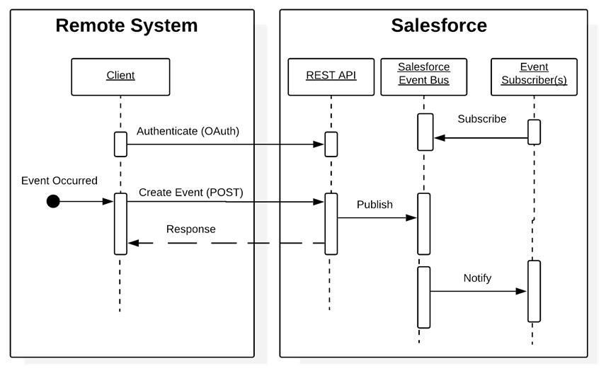

[Table of Contents](../Documentation.md)

# Remote Call-In

## Description

## Solutions
| Solution | Fit | Data Master | Comments                      |
|----------|-----|-------------|------------------------------|
|SOAP API|Best| |
|REST API|Best| |
|Apex web services|Suboptimal|	Apex class methods can be exposed as web service methods to external applications. This method is an alternative to SOAP API, and is typically used only where the following additional requirements must be met. Full transactional support is required (for example, create an account, contact, and opportunity all in one transaction). Custom logic must be applied on the Salesforce side before committing. The benefit of using an Apex web service must be weighed against the additional code that needs to be maintained in Salesforce. Not applicable for platform events because transaction pre-insert logic at the consumer doesn’t apply in an event-driven architecture. To notify a Salesforce org that an event has occurred, use SOAP API, REST API, or Bulk API 2.0.|
|Apex REST services|Suboptimal|An Apex class can be exposed as REST resources mapped to specific URIs with an HTTP verb defined against it (for example, POST or GET). You can use REST API composite resources to perform multiple updates in a single transaction. Unlike SOAP, there’s no need for the client to consume a service definition/contract (WSDL) and generate client stubs. The remote system requires only the ability to form an HTTP request and process the returned results (XML or JSON). Not applicable for platform events because transaction pre-insert logic at the consumer doesn’t apply in an event-driven architecture. To notify a Salesforce org that an event has occurred, use SOAP API, REST API, or Bulk API 2.0.|
|Bulk API 2.0|Optimal for bulk operations|Bulk API 2.0 is based on REST principles, and is optimized for loading or deleting large sets of data. It has the same accessibility and security behavior as REST API. Any data operation that includes more than 2,000 records is a good candidate for Bulk API 2.0 to successfully prepare, execute, and manage an asynchronous workflow that uses the Bulk framework. Jobs with fewer than 2,000 records should involve “bulkified” synchronous calls in REST (for example, Composite) or SOAP. Bulk API 2.0 allows the client application to query, insert, update, upsert, or delete a large number of records asynchronously by submitting a number of batches, which are processed in the background by Salesforce. In contrast, SOAP API is optimized for real-time client applications that update small numbers of records at a time. Although SOAP API can also be used for processing large numbers of records, when the data sets contain hundreds of thousands to millions of records, it becomes less practical. This is due to its relatively high overhead and lower performance characteristics. Event-Driven Architecture—Platform events are defined the same way you define Salesforce objects. Publishing an event via Bulk API 2.0 is the same as creating a Salesforce record. Only the create and insert operations are supported. Events within a batch are published to the Salesforce event bus asynchronously as the batch job is processed.|

## Sequence Diagram

## Middleware considerations

| Property            | Mandatory | Desirable | Not required |
|---------------------|-----------|-----------|---------|
| Event Handling | | ✅ | |
| Protocol conversion | | ✅ | |
| Translation and transformation | | ✅ | |
| Queuing and buffering | ✅ | | |
| Synchronous transport protocols | ✅ | | |
| Asynchronous transport protocols | | | ✅ |
| Mediation routing | | ✅ | |
| Process choreography and service orchestration | | ✅ | |
| Transactionality (encryption, signing, reliable delivery, transaction management) | ✅ | | |
| Routing | | | ✅ |
| Extract, transform, and load | | ✅ (for bulk/batches) | |
| Long Polling | | | ✅ |

