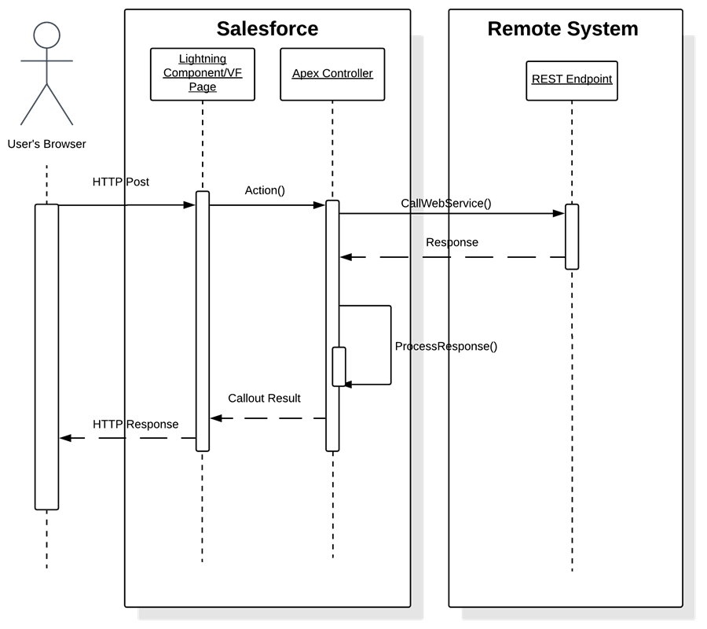

[Table of Contents](../Documentation.md)

# Request & Reply

## Description
Purpose of this pattern is to trigger an action or import data to an external system synchronously (real time).
The caller expects a response that he can use to continue its process.

## Solutions

| Solution       | Fit     | Comments                         |
|----------------|---------|---------------------------------|
|Enhanced External Services invokes a REST API call|Best|Enhanced External Services allows you to invoke an externally hosted service in a declarative manner (no code required). This feature is best used when the following conditions are met: The externally hosted service is a RESTful service and the definitions are available in an OpenAPI 2.0 JSON schema format. The request and response definitions contain primitive data types such as boolean, datetime, double, integer, string, or an array of primitive data types. Nested object types, and send parameters such as headers within the HTTP requests are supported.
The transaction can be invoked from a flow.|
|Salesforce Lightning—Lightning component or page initiates a synchronous Apex SOAP or REST callout.|Best|Salesforce enables you to consume a WSDL and generate a resulting proxy Apex class. This class provides the necessary logic to call the remote service. Salesforce also enables you to invoke HTTP (REST) services using standard GET, POST, PUT, and DELETE methods. A user-initiated action on a Visualforce page or Lightning page then calls an Apex controller action that then executes this proxy Apex class to perform the remote call. Visualforce pages and Lightning pages require customization of the Salesforce application.|
|A custom Visualforce page or button initiates a synchronous Apex HTTP callout.|Best|Salesforce enables you to invoke HTTP services using standard GET, POST, PUT, and DELETE methods. You can use several HTTP classes to integrate with RESTful services. It’s also possible to integrate to SOAP-based services by manually constructing the SOAP message. The latter isn’t recommended because it’s possible for Salesforce to consume WSDLs to generate proxy classes. A user-initiated action on a Visualforce page then calls an Apex controller action that then executes this proxy Apex class to perform the remote call. Visualforce pages require customization of the Salesforce application.|
|A synchronous trigger that’s invoked from Salesforce data changes performs an asynchronous Apex SOAP or HTTP callout.|Suboptimal| You can use Apex triggers to perform automation based on record data changes. An Apex proxy class can be executed as the result of a DML operation by using an Apex trigger. However, all calls made from within the trigger context must execute asynchronously from the initiating event. Therefore, this solution isn’t recommended for this integration problem. This solution is better suited for the Remote Process Invocation—Fire and Forget pattern.|
|A batch Apex job performs a synchronous Apex SOAP or HTTP callout.|Suboptimal|You can make calls to a remote system from a batch job. This solution allows batch remote process execution and processing of the response from the remote system in Salesforce. However, a given batch has limits to the number of calls. For more information, see Governor Limits. A given batch run can execute multiple transaction contexts (usually in intervals of 200 records). The governor limits are reset per transaction context.|

## Sequence Diagram

## Middleware considerations

| Property            | Mandatory | Desirable | Not required |
|---------------------|-----------|-----------|---------|
| Event Handling | | ✅ | |
| Protocol conversion | | ✅ | |
| Translation and transformation | | ✅ | |
| Queuing and buffering | | ✅ | |
| Synchronous transport protocols | ✅ | | |
| Asynchronous transport protocols | | | ✅ |
| Mediation routing | | ✅ | |
| Process choreography and service orchestration | | ✅ | |
| Transactionality (encryption, signing, reliable delivery, transaction management) | | ✅ | |
| Routing | | | ✅ |
| Extract, transform, and load | | | ✅ |
| Long Polling | | | ✅ |

